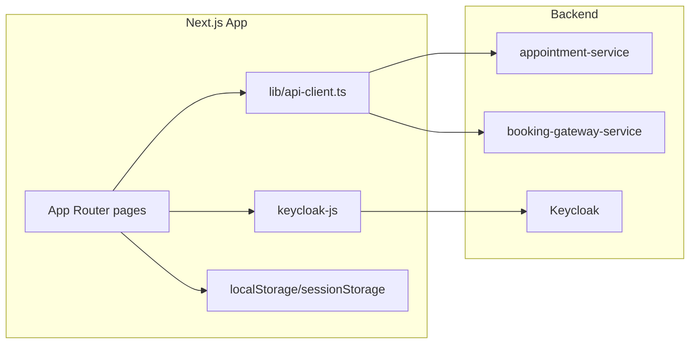
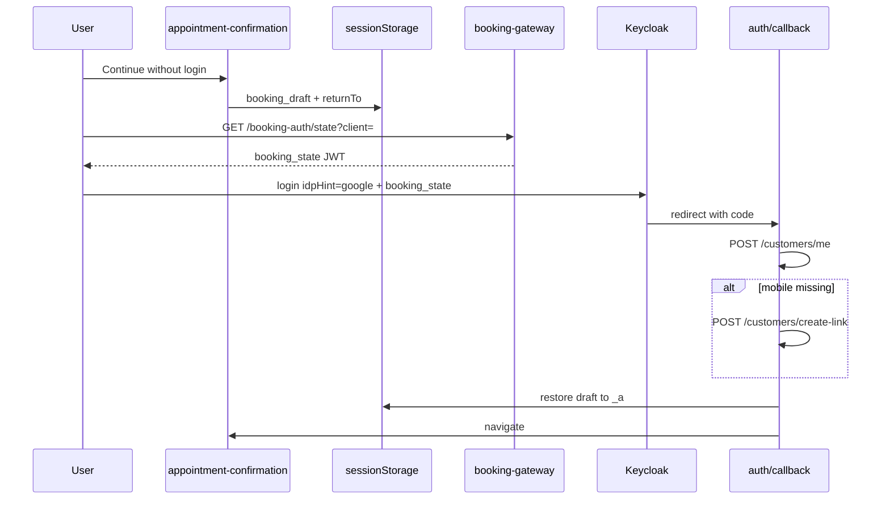

# Beautech Appointment Booking — Next.js Migration Reference

This document is the implementation blueprint for rebuilding the Angular booking app in **Next.js 14+ (App Router)**. The Angular project in this repo is the **source of truth for UI** (Tailwind classes, layout, flows). Use this guide for APIs, auth, routes, storage, and page-by-page wiring.

---

## Table of contents

1. [Overview and architecture](#1-overview-and-architecture)
2. [Environment variables](#2-environment-variables)
3. [HTTP client and headers](#3-http-client-and-headers)
4. [Complete API reference](#4-complete-api-reference)
5. [Authentication flow](#5-authentication-flow)
6. [Routes and page checklist](#6-routes-and-page-checklist)
7. [State and storage](#7-state-and-storage)
8. [Per-page API usage](#8-per-page-api-usage)
9. [Styling and UI porting](#9-styling-and-ui-porting)
10. [Implementation phases and test plan](#10-implementation-phases-and-test-plan)

---

## 1. Overview and architecture

### What this app does

- Multi-tenant online salon/spa booking
- Tenant is passed via URL query: `?client=<tenant-id>` (e.g. `demo`, `demo.beautech.biz`)
- 7-step booking wizard → Google login (Keycloak) → confirmation → success
- Profile page for pending/completed appointments (auth required)

### Architecture



### Angular → Next.js mapping

| Angular | Next.js App Router |
|---------|-------------------|
| `src/app/app.routes.ts` | `app/**/page.tsx` + optional `middleware.ts` |
| `*Service` + HTTP interceptors | `lib/api-client.ts` + `lib/keycloak.ts` |
| `authGuard` | Client guard on `/profile` or `middleware.ts` |
| `MainLayoutComponent` | `app/(main)/layout.tsx` |
| Wizard `@switch(step)` | `/appointment?step=N` client component |
| `APP_INITIALIZER` + Keycloak | `KeycloakProvider` in `app/providers.tsx` |
| `TenantService` + `ClientContextService` | `lib/tenant.ts` |

### Recommended stack

| Layer | Choice |
|-------|--------|
| Framework | Next.js 14+ App Router |
| Styling | Tailwind CSS 3 (copy classes from Angular templates) |
| Auth | `keycloak-js` (same server as Angular) |
| Draft encryption | `crypto-js` AES (parity with Angular `_a` key) |
| Icons | `@heroicons/react` (replaces `@ng-icons/heroicons`) |
| Tables (profile) | PrimeReact `DataTable` **or** headless table + Tailwind |
| Carousels | `react-slick` or Swiper (replaces `ngx-slick-carousel`) |

### Angular source files (quick index)

| Area | Path |
|------|------|
| Routes | `src/app/app.routes.ts` |
| Environments | `src/environments/environment*.ts` |
| Services | `src/app/services/` |
| Auth | `src/app/auth/` |
| Pages | `src/app/pages/` |
| Wizard steps | `src/app/components/` |
| Global styles | `src/styles.scss` |

---

## 2. Environment variables

Create `.env.local` in your Next.js project.

### Development (matches `environment.ts`)

```env
NEXT_PUBLIC_BASE_URL=https://booking.beautech.biz
NEXT_PUBLIC_BOOKING_GATEWAY_URL=https://booking.beautech.biz/api/v1/booking-gateway-service
NEXT_PUBLIC_KEYCLOAK_URL=https://auth.beautech.biz/
NEXT_PUBLIC_KEYCLOAK_REALM=beautech
NEXT_PUBLIC_KEYCLOAK_CLIENT_ID=booking-client
# Prefer server-only; use NEXT_PUBLIC only if client must encrypt _a
ENCRYPTION_KEY=dev-key-change-in-release
```

### Staging (matches `environment.staging.ts`)

```env
NEXT_PUBLIC_BASE_URL=https://devbooking.beautech.biz
NEXT_PUBLIC_BOOKING_GATEWAY_URL=https://devbooking.beautech.biz/api/v1/booking-gateway-service
```

Keycloak settings are the same across environments.

### Production (matches `environment.release.ts`)

```env
NEXT_PUBLIC_BASE_URL=https://booking.beautech.biz
NEXT_PUBLIC_BOOKING_GATEWAY_URL=https://booking.beautech.biz/api/v1/booking-gateway-service
ENCRYPTION_KEY=<strong-secret-from-ci>
```

### Constants

| Constant | Value |
|----------|-------|
| Appointment API prefix | `{NEXT_PUBLIC_BASE_URL}/api/v1/appointment-service` |
| Keycloak realm | `beautech` |
| Keycloak client | `booking-client` |

> **Note:** `apiUrl` (`accto.co/subscription`) in Angular environments is **unused** — do not add it to Next.js.

---

## 3. HTTP client and headers

Angular uses two interceptors. Combine them in a single `lib/api-client.ts`.

| Header | Source | When |
|--------|--------|------|
| `Authorization: Bearer {token}` | `keycloak.updateToken(30)` then `keycloak.token` | Logged in, not logging out |
| `X-Client-Id: {tenant}` | `?client=` or `sessionStorage.booking_client_id` | Always when tenant known |

**Skip `Authorization` when:**

- `sessionStorage.keycloak_logout_complete === 'true'` (logout in progress/completed)
- Request URL is Keycloak (`auth.beautech.biz`, `/realms/`, `/token`, `/logout`)

**Angular references:**

- `src/app/auth/auth.interceptor.ts`
- `src/app/services/client.interceptor.service.ts`

### Example: `lib/api-client.ts`

```typescript
'use client';

import { getKeycloak } from './keycloak';
import { getClientId } from './tenant';

const APPT_BASE = `${process.env.NEXT_PUBLIC_BASE_URL}/api/v1/appointment-service`;
const GATEWAY_BASE = process.env.NEXT_PUBLIC_BOOKING_GATEWAY_URL!;

function isLogoutInProgress(): boolean {
  if (typeof window === 'undefined') return false;
  return sessionStorage.getItem('keycloak_logout_complete') === 'true';
}

function isKeycloakUrl(url: string): boolean {
  const u = url.toLowerCase();
  return (
    u.includes('keycloak') ||
    u.includes('auth.beautech.biz') ||
    u.includes('/protocol/openid-connect/') ||
    u.includes('/realms/') ||
    u.includes('/token') ||
    u.includes('/logout')
  );
}

export async function fetchApi<T>(
  path: string,
  options: RequestInit & { base?: 'appointment' | 'gateway' } = {}
): Promise<T> {
  const base = options.base === 'gateway' ? GATEWAY_BASE : APPT_BASE;
  const url = path.startsWith('http') ? path : `${base}${path}`;

  const headers = new Headers(options.headers);
  headers.set('Content-Type', 'application/json');

  const clientId = getClientId();
  if (clientId) headers.set('X-Client-Id', clientId);

  if (!isLogoutInProgress() && !isKeycloakUrl(url)) {
    const kc = getKeycloak();
    if (kc?.authenticated && kc.token) {
      await kc.updateToken(30);
      if (kc.token) headers.set('Authorization', `Bearer ${kc.token}`);
    }
  }

  const res = await fetch(url, { ...options, headers });
  if (!res.ok) {
    const err = new Error(`API ${res.status}: ${res.statusText}`);
    (err as any).status = res.status;
    throw err;
  }
  return res.json() as Promise<T>;
}
```

### Example: `lib/tenant.ts`

```typescript
const STORAGE_KEY = 'booking_client_id';

const ALLOWED_TENANTS_DEV = ['demo', 'test', 'dev', 'salon1', 'salon2', 'demo.beautech.biz'];
const ALLOWED_TENANTS_PROD = ['demo', 'salon1', 'salon2', 'demo.beautech.biz'];

export function validateAndSetClientId(raw: string | null, isProd = false): string {
  if (!raw?.trim()) throw new Error('Missing tenant parameter. Expected ?client=<tenant-id>');

  const sanitized = raw.trim().replace(/[^a-zA-Z0-9\-_.]/g, '');
  if (sanitized !== raw.trim()) throw new Error('Invalid tenant format');
  if (sanitized.length < 2 || sanitized.length > 100) throw new Error('Invalid tenant length');

  const allowed = isProd ? ALLOWED_TENANTS_PROD : ALLOWED_TENANTS_DEV;
  const isAllowed =
    allowed.includes(sanitized) ||
    (!isProd && sanitized.endsWith('.beautech.biz'));

  if (!isAllowed) throw new Error(`Invalid tenant: ${sanitized}`);

  if (typeof window !== 'undefined') sessionStorage.setItem(STORAGE_KEY, sanitized);
  return sanitized;
}

export function getClientId(): string | null {
  if (typeof window === 'undefined') return null;
  return sessionStorage.getItem(STORAGE_KEY)?.trim() || null;
}
```

Port full validation from `src/app/auth/tenant.service.ts` as needed.

---

## 4. Complete API reference

**Base URL:** `{NEXT_PUBLIC_BASE_URL}/api/v1/appointment-service`

All appointment-service calls need `Authorization` (when logged in) + `X-Client-Id`.

### Endpoint summary

| # | Method | Path | Query / Body | Used by |
|---|--------|------|--------------|---------|
| 1 | GET | `/branches` | — | Step 2 — branch selection |
| 2 | GET | `/treatments/list-images` | `branchId` | Step 3 — services |
| 3 | GET | `/categories` | `branchId` | Step 3 — category filter |
| 4 | GET | `/employees/list` | `branchId` | Step 4 — professionals |
| 5 | GET | `/schedules/get-available-slots-by-date` | `employeeId`, `timeDuration`, `date` | Step 5 — time picker |
| 6 | POST | `/customers/me` | `{}` | Callback, profile, confirmation |
| 7 | POST | `/customers/create-link` | `{ phoneNumber }` | Callback phone form |
| 8 | POST | `/appointments` | `AppointmentRequest` | Confirmation submit |
| 9 | GET | `/appointments/customer` | optional `?status=` | **Unused in UI** |
| 10 | POST | `/appointments/online/list` | paginated body | Profile page |
| 11 | GET | `/appointments/online/{id}` | — | Post-create detail |
| 12 | GET | `{gateway}/public/booking-auth/state` | `client` | Google login prep |

---

### 1. List branches

```
GET /api/v1/appointment-service/branches
```

**Response:** array of branch objects.

**Angular:** `src/app/services/branch.service.ts` → `BranchSelectionComponent`

```typescript
export interface Branch {
  id: number;
  name: string;
  imageUrl?: string | null;
  address?: string | null;
  phone?: string | null;
  email?: string | null;
  description?: string | null;
  isActive?: boolean;
}
```

---

### 2. List treatments (with images)

```
GET /api/v1/appointment-service/treatments/list-images?branchId={id}
```

**Response:** `any[]` — items include `id`, `name`, `price`, `duration`, `categoryId`, `category`, `imageUrl`.

**Angular:** `src/app/services/company-service.service.ts` → `ServicesComponent`

> **Fix in Next.js:** Angular hardcodes `branchId=1`. Pass the **selected branch id** from wizard state (`_a.branch.id`).

---

### 3. List categories

```
GET /api/v1/appointment-service/categories?branchId={id}
```

Same bug/fix as treatments — use real `branchId`.

---

### 4. List employees / professionals

```
GET /api/v1/appointment-service/employees/list?branchId={id}
```

**Angular:** `src/app/services/professional.service.ts` → `ProfessionalsComponent`

```typescript
export interface Professional {
  id: number;
  name: string;
  gender?: string | null;
  branchId?: number | null;
  mobile?: string | null;
  email?: string | null;
  imageUrl?: string | null;
}
```

---

### 5. Available time slots

```
GET /api/v1/appointment-service/schedules/get-available-slots-by-date
  ?employeeId={id}&timeDuration={minutes}&date={YYYY-MM-DD}
```

**Response:** `{ startTime, endTime, id?, price? }[]`

**Angular:** `src/app/services/time-picker.service.ts` → `TimeSelectorComponent`

`timeDuration` = sum of selected services' `duration`.

---

### 6. Current customer (`/me`)

```
POST /api/v1/appointment-service/customers/me
Body: {}
```

**Response:** `CustomerDto` — `id: null` means customer not linked yet (show phone form, not an error).

**Angular:** `src/app/services/customerService.ts`

```typescript
export interface CustomerDto {
  id: number | null;
  email: string | null;
  mobile: string | null;
  name?: string | null;
  code?: string | null;
  gender?: string | null;
  [key: string]: unknown;
}
```

---

### 7. Create / link customer by phone

```
POST /api/v1/appointment-service/customers/create-link
Body: { "phoneNumber": "0761234567" }
```

**Response:** `CustomerDto` with `id`.

**Errors:** `400` invalid phone, `409` already registered.

---

### 8. Create appointment

```
POST /api/v1/appointment-service/appointments
Body: AppointmentRequest
```

**Response:** `{ id }` or `{ data: { id } }` (handle both).

**Angular:** `src/app/services/appointment.service.ts` → `AppointmentConformationComponent`

```typescript
export interface AppointmentRequest {
  twoServesSameTime: boolean;
  walkInCustomer: boolean;
  waiting: boolean;
  isRequestedEmployee: boolean;
  doubleStation: boolean;
  amount: number;
  tax: number;
  discount: number;
  status: string; // 'PENDING'
  treatments: Treatment[];
  otherComboAppointments: unknown[];
  branchId: number;
  date: string;
  employeeId: string | number;
  customerId: number;
  customer?: unknown;
}

export interface Treatment {
  id: number;
  name: string;
  price: number;
  category: { id: number; name: string };
  color?: string;
  duration: number;
  combo: boolean;
  categoryId: number;
  comboTreatmentMappings?: unknown;
  employeeId: number;
  startTime: string; // "HH:mm"
}
```

---

### 9. List customer appointments (legacy GET) — unused

```
GET /api/v1/appointment-service/appointments/customer?status=PENDING|COMPLETED
```

Defined in `appointment.service.ts` but profile uses endpoint #10 instead.

---

### 10. List appointments (paginated, online)

```
POST /api/v1/appointment-service/appointments/online/list
Body: {
  "page": 1,
  "perPage": 1000,
  "filter": { "customerId": 123 }
}
```

**Response:** `response.result` or `response.data` (array). Profile filters client-side by `status` (`PENDING` / `COMPLETED`).

---

### 11. Get appointment by ID

```
GET /api/v1/appointment-service/appointments/online/{appointmentId}
```

Called after create to load full details before success redirect.

---

### 12. Booking auth state (gateway)

```
GET {NEXT_PUBLIC_BOOKING_GATEWAY_URL}/public/booking-auth/state?client={tenant}
```

**Response:** `{ state: string }` — signed JWT passed as `booking_state` to Keycloak.

**Headers:** `X-Client-Id` only (Bearer optional).

**Angular:** `src/app/auth/booking-auth.service.ts`

---

### `transformAppointmentData` — draft → API body

Port from `src/app/services/appointment.service.ts` (lines 64–137) into `lib/transform-appointment.ts`.

**Input** (from `_a` / `booking_draft`):

```json
{
  "branch": { "id": 2, "name": "Colombo" },
  "services": [
    {
      "id": 10,
      "name": "Haircut",
      "price": 2500,
      "duration": 45,
      "categoryId": 3,
      "category": { "id": 3, "name": "Hair" }
    }
  ],
  "professional": { "id": 5, "name": "Jane" },
  "schedule": {
    "date": "2026-06-26",
    "selectedTime": { "selectedTime": "10:30" },
    "employeeId": 5
  }
}
```

**Output** (`AppointmentRequest`):

```json
{
  "twoServesSameTime": false,
  "walkInCustomer": false,
  "waiting": false,
  "isRequestedEmployee": false,
  "doubleStation": false,
  "amount": 2500,
  "tax": 0,
  "discount": 0,
  "status": "PENDING",
  "treatments": [
    {
      "id": 10,
      "name": "Haircut",
      "price": 2500,
      "category": { "id": 3, "name": "Hair" },
      "color": "#000000",
      "duration": 45,
      "combo": false,
      "categoryId": 3,
      "comboTreatmentMappings": null,
      "employeeId": 5,
      "startTime": "10:30"
    }
  ],
  "otherComboAppointments": [],
  "branchId": 2,
  "date": "2026-06-26",
  "employeeId": 5,
  "customerId": 42,
  "customer": { "id": 42, "mobile": "0761234567" }
}
```

**Rules:**

- `amount` = sum of service prices
- `startTime` on each treatment = normalized `HH:mm` from `schedule.selectedTime.selectedTime`
- `employeeId` = `professional.id` or `schedule.employeeId`
- Do **not** send appointment-level `startTime` / `endTime` (backend derives from treatments)

---

## 5. Authentication flow

### Sequence diagram



### Step 1 — Keycloak init

Mirror `src/app/auth/keycloak-init.ts`:

```typescript
import Keycloak from 'keycloak-js';

let keycloak: Keycloak | null = null;

export function initKeycloak(): Promise<Keycloak> {
  if (typeof window === 'undefined') throw new Error('Keycloak is client-only');

  keycloak = new Keycloak({
    url: process.env.NEXT_PUBLIC_KEYCLOAK_URL!,
    realm: process.env.NEXT_PUBLIC_KEYCLOAK_REALM!,
    clientId: process.env.NEXT_PUBLIC_KEYCLOAK_CLIENT_ID!,
  });

  return keycloak.init({
    pkceMethod: 'S256',
    checkLoginIframe: false,
  }).then(() => keycloak!);
}

export function getKeycloak() {
  return keycloak;
}
```

Wrap the app in a client `KeycloakProvider` (`app/providers.tsx`). Init on mount, not in Server Components.

### Step 2 — Google login

Mirror `src/app/auth/booking-auth.service.ts`:

1. `GET {gateway}/public/booking-auth/state?client={tenant}` → `{ state }`
2. `keycloak.createLoginUrl({ redirectUri: origin + '/auth/callback?client=' + tenant, idpHint: 'google' })`
3. Append query params: `booking_state={state}`, `prompt=select_account`
4. `window.location.href = url`

Triggered from wizard step 7 (`SocialMediaAuthenticationComponent`).

### Step 3 — OAuth callback (`/auth/callback`)

Mirror `src/app/auth/auth-callback.component.ts`:

1. Read `?client=` — error if missing
2. Check Keycloak `error` / `error_description` query params
3. Poll `keycloak.isLoggedIn()` up to 10 × 500ms
4. `logoutState.reset()` — clear `keycloak_logout_complete`
5. Load `booking_draft` from sessionStorage
6. `POST /customers/me`
   - `id === null` or invalid mobile → show phone form (10 digits, `/^[0-9]{10}$/`)
   - On phone submit → `POST /customers/create-link`
7. If `draft.returnTo === 'appointment-confirmation'`:
   - Copy draft (minus `returnTo`, `tenant`) → encrypted `_a` in localStorage
   - Clear `booking_draft`
   - Navigate `/appointment-confirmation?client={tenant}`
8. Else navigate home or confirmation

### Step 4 — Login required before booking submit

In `AppointmentConformationComponent.continue()`:

- If not logged in or `/me` returns `id: null`:
  - `booking_draft` = `{ ...appointment, tenant, returnTo: 'appointment-confirmation' }`
  - Redirect `/appointment?client={tenant}&step=7`

### Step 5 — Profile guard

Mirror `src/app/auth/auth.guard.ts`:

- `/profile` requires `keycloak.isLoggedIn()`
- If not logged in: `keycloak.login({ redirectUri: window.location.origin + '/profile?client=...' })`
- Allow `/appointment?step=7` without auth (login step)

### Step 6 — Logout

Mirror `src/app/auth/booking-auth.service.ts` `logout()`:

1. `setLoggingOut()` — clear `keycloak_logout_complete` flag during process
2. `keycloak.clearToken()`, set `authenticated = false`
3. Remove `kc-*` keys from localStorage
4. Clear `_a`, `booking_draft`, `last_appointment`, full storage
5. `keycloak.logout(redirectUri)`
6. `setLoggedOut()` — `sessionStorage.keycloak_logout_complete = 'true'`

### Next.js-specific rules

| Rule | Reason |
|------|--------|
| Keycloak only in `'use client'` components | Tokens live in browser |
| `/auth/callback` is a client page | OAuth code exchange is client-side |
| Do not call APIs from Server Components with user tokens | No Keycloak on server |
| Preserve `?client=` on every navigation | `X-Client-Id` header |

---

## 6. Routes and page checklist

### Route mapping

| Route | Next.js file | Port UI from |
|-------|--------------|--------------|
| `/` → `/home` | `app/(main)/home/page.tsx` | `src/app/pages/home/home.component.html` |
| `/appointment?step=1-7` | `app/(main)/appointment/page.tsx` | `appointment.component.html` + `src/app/components/*` |
| `/appointment-confirmation` | `app/(main)/appointment-confirmation/page.tsx` | `src/app/components/appointment-conformation/` |
| `/appointment-success` | `app/(main)/appointment-success/page.tsx` | `src/app/components/appointment-success/` |
| `/profile` | `app/(main)/profile/page.tsx` | `src/app/pages/profile/profile.component.html` |
| `/auth/callback` | `app/auth/callback/page.tsx` | `src/app/auth/auth-callback.component.ts` |
| `/login-failed` | `app/login-failed/page.tsx` | `src/app/auth/login-failed.component.ts` |
| `/login` | optional stub | `src/app/pages/auth/login/` (placeholder in Angular) |
| 404 | `app/not-found.tsx` | `src/app/pages/not-found/` |

Always append `?client={tenant}` when navigating.

### Booking wizard steps

From `src/app/pages/appointment/appointment.component.ts`:

| Step | Component | Saves to `_a` | Next step |
|------|-----------|---------------|-----------|
| 1 | Option | No | 2 |
| 2 | Branch | Yes (`branch`) | 3 |
| 3 | Services | Yes (`services`) | 4 |
| 4 | Professionals | Yes (`professional`) | 5 |
| 5 | Time | Yes (`schedule`) | 6 |
| 6 | Confirmation (embedded) | No | 7 if login needed |
| 7 | Google login | No | Keycloak redirect |

> Angular defines step 8 in code but has **no UI** for it. Stop at step 7 in Next.js.

**Two confirmation entry points:**

- Wizard step 6 at `/appointment?step=6`
- Standalone `/appointment-confirmation` (post-OAuth destination)

### Suggested project layout

```
app/
  layout.tsx
  providers.tsx                 # KeycloakProvider, tenant bootstrap
  not-found.tsx
  auth/
    callback/page.tsx           # 'use client'
  login-failed/page.tsx
  (main)/
    layout.tsx                  # header + footer (MainLayout)
    home/page.tsx
    appointment/page.tsx        # wizard shell + step switch
    appointment-confirmation/page.tsx
    appointment-success/page.tsx
    profile/page.tsx            # auth guard
lib/
  api-client.ts
  keycloak.ts
  tenant.ts
  booking-state.ts              # _a encryption + booking_draft
  transform-appointment.ts
  logout-state.ts
components/
  layout/Header.tsx
  booking/
    OptionStep.tsx
    BranchStep.tsx
    ServicesStep.tsx
    ProfessionalsStep.tsx
    TimeStep.tsx
    ConfirmationStep.tsx
    GoogleLoginStep.tsx
public/
  assets/                       # copy from Angular src/assets
```

### Component → Angular file map

| Next.js component | Angular source |
|-------------------|----------------|
| `OptionStep` | `src/app/components/option/` |
| `BranchStep` | `src/app/components/branch-selection/` |
| `ServicesStep` | `src/app/components/services/` |
| `ProfessionalsStep` | `src/app/components/professionals/` |
| `TimeStep` | `src/app/components/time-selector/` |
| `ConfirmationStep` | `src/app/components/appointment-conformation/` |
| `GoogleLoginStep` | `src/app/components/social-media-authentication/` |
| `Header` | `src/app/components/header/` |
| `Cart` (if used) | `src/app/components/cart/` |

---

## 7. State and storage

### Storage keys

| Key | Storage | Encrypted | Purpose |
|-----|---------|-----------|---------|
| `_a` | localStorage | Yes (AES) | Wizard draft: `branch`, `services`, `professional`, `schedule` |
| `booking_draft` | sessionStorage | No | Pre-OAuth snapshot + `tenant` + `returnTo` |
| `booking_client_id` | sessionStorage | No | Tenant for `X-Client-Id` |
| `last_appointment` | sessionStorage | No | Success page one-shot JSON (read then delete) |
| `keycloak_logout_complete` | sessionStorage | No | Block token refresh after logout |
| `kc-*` | localStorage | No | Keycloak-js token storage |

### Draft shape

```json
{
  "branch": { "id": 1, "name": "Main Branch", "imageUrl": "..." },
  "services": [
    { "id": 10, "name": "Manicure", "price": 50, "duration": 60, "categoryId": 2 }
  ],
  "professional": { "id": 5, "name": "Alex" },
  "schedule": {
    "date": "2026-06-26",
    "selectedTime": { "selectedTime": "10:00" },
    "employeeId": 5
  }
}
```

`booking_draft` adds:

```json
{
  "...appointment fields...",
  "tenant": "demo",
  "returnTo": "appointment-confirmation"
}
```

### Encrypted localStorage (`lib/booking-state.ts`)

Port from `src/app/services/local-storage.service.ts`:

```typescript
import CryptoJS from 'crypto-js';

const APPOINTMENT_KEY = '_a';
const DRAFT_KEY = 'booking_draft';

function getKey(): string {
  return (
    process.env.ENCRYPTION_KEY ||
    process.env.NEXT_PUBLIC_ENCRYPTION_KEY ||
    `dev-fallback-key-${typeof window !== 'undefined' ? window.location.hostname : 'ssr'}`
  );
}

function encrypt(text: string): string {
  const key = getKey();
  if (!key) return text;
  return CryptoJS.AES.encrypt(text, key).toString();
}

function decrypt(cipher: string): string {
  const key = getKey();
  if (!key || !cipher) return '';
  return CryptoJS.AES.decrypt(cipher, key).toString(CryptoJS.enc.Utf8);
}

export function saveAppointmentDraft(data: unknown): void {
  localStorage.setItem(APPOINTMENT_KEY, encrypt(JSON.stringify(data)));
}

export function loadAppointmentDraft<T>(): T | null {
  const raw = localStorage.getItem(APPOINTMENT_KEY);
  if (!raw) return null;
  try {
    return JSON.parse(decrypt(raw)) as T;
  } catch {
    return null;
  }
}

export function setBookingDraft(draft: unknown): void {
  sessionStorage.setItem(DRAFT_KEY, JSON.stringify(draft));
}

export function getBookingDraft<T>(): T | null {
  const raw = sessionStorage.getItem(DRAFT_KEY);
  return raw ? (JSON.parse(raw) as T) : null;
}

export function clearBookingDraft(): void {
  sessionStorage.removeItem(DRAFT_KEY);
}
```

### Wizard persistence logic

| Event | Action |
|-------|--------|
| Step 2–5 complete | Merge into draft → `saveAppointmentDraft` |
| User continues confirmation without login | `setBookingDraft` with `returnTo` |
| OAuth callback success | Draft → `_a`, `clearBookingDraft` |
| Appointment created | `sessionStorage.last_appointment` = API response |
| Success page load | Read + delete `last_appointment`, clear `_a` |
| Logout | Clear all keys |

---

## 8. Per-page API usage

### Home (`/home?client=`)

| When | API | Notes |
|------|-----|-------|
| Mount | None | Validate tenant, set `booking_client_id` |
| CTA click | None | Navigate `/appointment?step=1&client=` |

**UI source:** `src/app/pages/home/home.component.html`

---

### Step 2 — Branch (`?step=2`)

| When | API |
|------|-----|
| Mount | `GET /branches` |

User selects branch → save to `_a` → `?step=3`.

---

### Step 3 — Services (`?step=3`)

| When | API |
|------|-----|
| Mount (branch id known) | `GET /categories?branchId={id}` |
| Mount | `GET /treatments/list-images?branchId={id}` |

Use `_a.branch.id`, **not** hardcoded `1`.

---

### Step 4 — Professionals (`?step=4`)

| When | API |
|------|-----|
| Mount | `GET /employees/list?branchId={id}` |

---

### Step 5 — Time (`?step=5`)

| When | API |
|------|-----|
| Date + professional + total duration set | `GET /schedules/get-available-slots-by-date` |

Params:

- `employeeId` = `professional.id`
- `timeDuration` = sum of `services[].duration`
- `date` = `YYYY-MM-DD`

---

### Step 6 / Confirmation (`?step=6` or `/appointment-confirmation`)

| When | API |
|------|-----|
| Page load | Read `_a` from localStorage |
| Continue click | `POST /customers/me` |
| Not logged in | Save `booking_draft` → redirect `?step=7` |
| Logged in + customer OK | `POST /appointments` with `transformAppointmentData` |
| After create | `GET /appointments/online/{id}` |
| Success | `sessionStorage.last_appointment` → `/appointment-success` |

---

### Step 7 — Google login (`?step=7`)

| When | API |
|------|-----|
| Button click | `GET {gateway}/public/booking-auth/state?client=` then Keycloak redirect |

No appointment API until callback completes.

---

### Auth callback (`/auth/callback?client=`)

| When | API |
|------|-----|
| After Keycloak login | `POST /customers/me` |
| Phone form submit | `POST /customers/create-link` |

Then navigate per [section 5](#5-authentication-flow).

---

### Profile (`/profile?client=`)

| When | API |
|------|-----|
| Mount (auth required) | `POST /customers/me` |
| Customer id known | `POST /appointments/online/list` with `perPage: 1000` |
| Display | Filter `PENDING` / `COMPLETED` client-side |

**UI source:** `src/app/pages/profile/profile.component.html` (PrimeNG tables → PrimeReact or Tailwind table).

---

### Success (`/appointment-success`)

| When | API |
|------|-----|
| Mount | **None** — read `sessionStorage.last_appointment`, then remove |

---

### Login failed (`/login-failed`)

| When | API |
|------|-----|
| Mount | None — retry navigates home with `?client=` |

---

## 9. Styling and UI porting

### Global buttons

Copy utility classes from `src/styles.scss` into `app/globals.css` using `@layer components`:

| Class | Appearance |
|-------|------------|
| `.btn` | `rounded-full`, flex, focus ring |
| `.btn-primary` | `bg-zinc-900`, `hover:bg-rose-500` |
| `.btn-secondary` | white border, zinc text |
| `.btn-hero` | rose-to-pink gradient, shadow |
| `.btn-ghost` | light border |
| `.btn-danger-outline` | red outline |
| `.btn-icon-ghost` | circular icon button |
| `.btn-icon-close` | transparent on dark backgrounds |

All buttons use **`rounded-full`** (pill shape).

### Theme

- Home / 404: dark hero `bg-[#0b0b0f]`, white text, rose accents
- Booking wizard: light cards on neutral background
- Copy Tailwind classes directly from Angular `.html` files — structure changes (`className` vs `class`, `onClick` vs `(click)`) but styles stay the same

### Icons

| Angular | Next.js |
|---------|---------|
| `@ng-icons/heroicons` + `provideIcons` | `@heroicons/react/24/outline` |
| `<ng-icon name="heroCheckCircle">` | `<CheckCircleIcon className="h-5 w-5" />` |

### Third-party UI

| Angular | Next.js option |
|---------|----------------|
| PrimeNG `p-table`, `p-tag`, `p-paginator` | PrimeReact or custom Tailwind table |
| `ngx-slick-carousel` | `react-slick` + `slick-carousel` CSS |
| `ngx-spinner` | `react-spinners` or Tailwind animate |
| `date-carousel` | Custom date picker or `react-day-picker` |

### Assets

Copy `src/assets/` to `public/assets/` in Next.js. Image paths become `/assets/images/...`.

---

## 10. Implementation phases and test plan

### Phase checklist

- [ ] **1. Scaffold** — `create-next-app` with TypeScript, Tailwind, App Router; add env vars
- [ ] **2. API client** — `lib/api-client.ts`, `lib/tenant.ts`; test `GET /branches` with `?client=demo`
- [ ] **3. Keycloak** — `lib/keycloak.ts`, `providers.tsx`, `/auth/callback` page
- [ ] **4. Layout + home** — port header, footer, home hero; tenant bootstrap on load
- [ ] **5. Wizard 1–5** — option → branch → services → professionals → time; `_a` persistence
- [ ] **6. Confirmation** — standalone route + step 6; `transformAppointmentData`; create flow
- [ ] **7. Google login** — step 7, `booking_draft`, callback restore
- [ ] **8. Profile** — auth guard, `/me`, paginated list, pending/completed tables
- [ ] **9. Polish** — success page, 404, login-failed, logout, error states

### Scaffold command

```bash
npx create-next-app@latest beautech-booking --typescript --tailwind --eslint --app --src-dir
cd beautech-booking
npm install keycloak-js crypto-js
npm install -D @types/crypto-js
npm install @heroicons/react
# optional: npm install primereact primeicons react-slick slick-carousel
```

### Test plan

| # | Scenario | Expected |
|---|----------|----------|
| 1 | Open `/home?client=demo` | Tenant stored; `X-Client-Id: demo` on API calls |
| 2 | Invalid `?client=bad` | Error message (mirror `TenantService`) |
| 3 | Full booking while logged out | Steps 1–6 → step 7 Google → callback → confirmation → success |
| 4 | `/me` returns `id: null` | Phone form on callback; after submit → confirmation |
| 5 | Logged-in user books | Skip step 7; create appointment directly |
| 6 | Profile after login | Pending and completed tables populated |
| 7 | Logout | All storage cleared; profile requires login again |
| 8 | Services for branch 2 | Treatments/categories use branch 2 id (not hardcoded 1) |
| 9 | Refresh mid-wizard | `_a` restores branch/services/pro/time selections |
| 10 | Success page | Shows `last_appointment`; draft `_a` cleared |

### Known quirks (from Angular — address in Next.js)

| Issue | Angular behavior | Next.js recommendation |
|-------|------------------|------------------------|
| Hardcoded `branchId=1` | Services/categories always fetch branch 1 | Use `_a.branch.id` |
| Step 8 dead code | `setObject('logIn')` sets step 8, no UI | Stop at step 7 |
| GET `/appointments/customer` | Defined but unused | Use POST `online/list` only |
| `/me` with `id: null` | Not an error — phone form | Same UX on callback |
| Duplicate confirmation | Step 6 embedded + `/appointment-confirmation` | Support both paths |
| `enter-mobile` component | Exists but unrouted | Phone form lives in callback only |

---

## Quick reference: end-to-end booking flow

```mermaid
flowchart TD
  start[Home ?client=] --> s1[Step 1 Option]
  s1 --> s2[Step 2 Branch - GET branches]
  s2 --> s3[Step 3 Services - GET categories + treatments]
  s3 --> s4[Step 4 Professionals - GET employees]
  s4 --> s5[Step 5 Time - GET slots]
  s5 --> s6[Step 6 Confirmation]
  s6 --> loggedIn{Logged in + customer?}
  loggedIn -->|No| s7[Step 7 Google login]
  s7 --> callback[/auth/callback]
  callback --> conf[/appointment-confirmation]
  loggedIn -->|Yes| conf
  conf --> create[POST appointments]
  create --> success[/appointment-success]
```

---

## Appendix: npm packages mapping

| Angular package | Next.js equivalent |
|-----------------|-------------------|
| `@angular/*` | `next`, `react`, `react-dom` |
| `keycloak-angular` + `keycloak-js` | `keycloak-js` |
| `crypto-js` | `crypto-js` |
| `primeng` | `primereact` (optional) |
| `@ng-icons/heroicons` | `@heroicons/react` |
| `rxjs` | native `async/await` + React state |
| `ngx-slick-carousel` | `react-slick` |

---

*Generated from the Angular codebase at `beautech-appointment-v2-frontend`. Update this doc when backend contracts or Angular flows change.*
